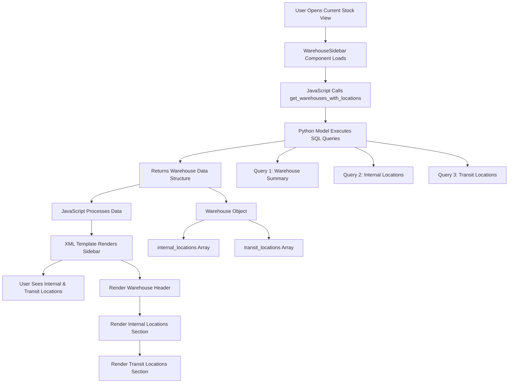
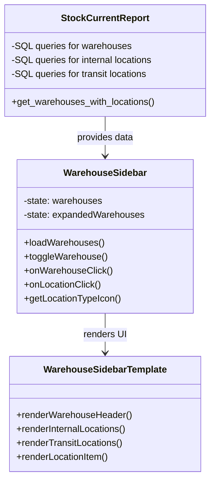
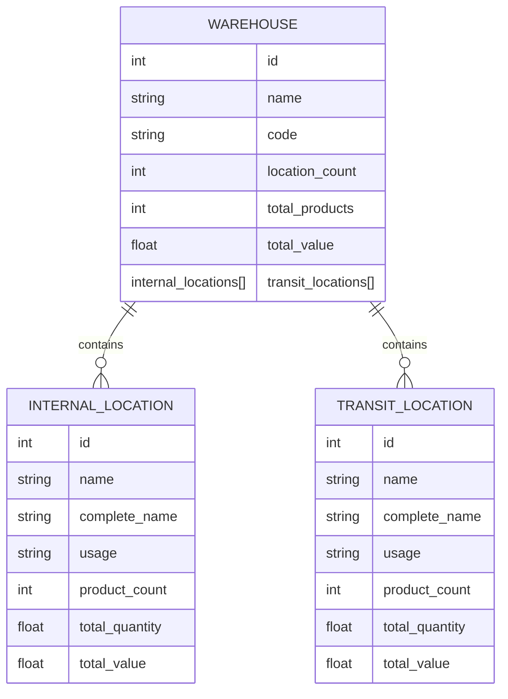

# Architecture Diagram: Enhanced Warehouse Sidebar with Transit Locations

## Data Flow



## Component Structure



## Data Structure



## UI Layout

```mermaid
graph TB
    subgraph Warehouse Sidebar
        WH[Warehouse Header]
        WH --> IL[Internal Locations Section]
        WH --> TL[Transit Locations Section]
        
        subgraph Internal Locations
            IL1[Location 1]
            IL2[Location 2]
            IL3[...]
        end
        
        subgraph Transit Locations
            TL1[Transit Location 1]
            TL2[Transit Location 2]
            TL3[...]
        end
    end
    
    subgraph Main Content
        R[Stock Report Table/Kanban]
    end
    
    IL1 --> R
    IL2 --> R
    TL1 --> R
    TL2 --> R