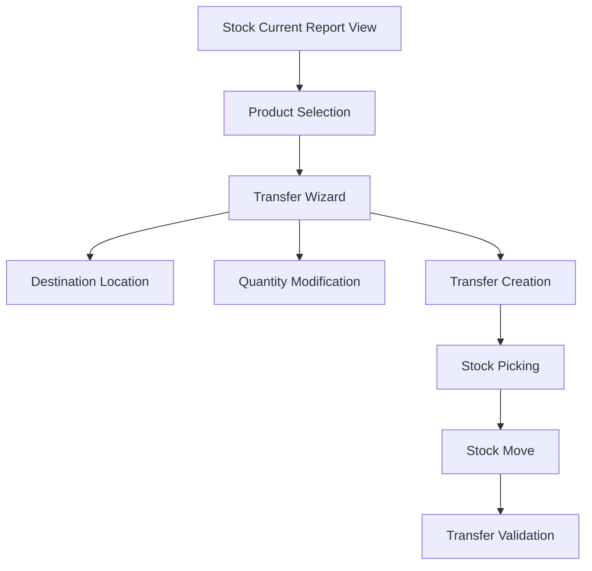

# Easy Pick Product Transfer Feature Implementation Plan

## Overview
This document outlines the implementation of an "Easy Pick Product Transfer" feature for the buz_stock_current_report module. The feature will allow users to select products directly from the kanban and list views of the current stock report and create transfers with customizable quantities.

## Architecture Diagram



## Technical Components

### 1. Wizard Model: `stock.current.transfer.wizard`
- **Purpose**: Handle the transfer creation process with quantity modification
- **Key Fields**:
  - `source_location_id`: Auto-populated from selected products
  - `destination_location_id`: User-selectable destination
  - `line_ids`: One2many relationship with transfer lines
  - `immediate_transfer`: Boolean for immediate validation

### 2. Wizard Line Model: `stock.current.transfer.wizard.line`
- **Purpose**: Manage individual product lines with quantity modification
- **Key Fields**:
  - `product_id`: Reference to product
  - `source_location_id`: Source location for this product
  - `available_quantity`: Read-only field showing current stock
  - `quantity_to_transfer`: User-modifiable quantity with validation
  - `uom_id`: Unit of measure

### 3. JavaScript Enhancements
- **Selection Management**: Track selected products across kanban and list views
- **Transfer Action**: Open wizard with pre-populated selected products
- **UI Updates**: Add checkboxes and transfer buttons to views

### 4. View Modifications
- **Kanban View**: Add selection checkbox and bulk transfer button
- **List View**: Add selection column and bulk transfer button
- **Wizard Views**: Create intuitive transfer wizard interface

## Implementation Steps

### Phase 1: Backend Models & Security
1. Create wizard models with proper field definitions
2. Implement validation logic for quantities
3. Add security access rights
4. Create transfer creation logic

### Phase 2: Frontend Views
1. Design wizard view forms
2. Update kanban view with selection UI
3. Update list view with selection UI
4. Add CSS styling for new elements

### Phase 3: JavaScript Integration
1. Implement selection tracking
2. Add transfer action handlers
3. Integrate with existing view controllers
4. Add user feedback notifications

### Phase 4: Integration & Testing
1. Update manifest file
2. Test complete workflow
3. Validate edge cases
4. Performance optimization

## User Workflow

1. **Product Selection**:
   - User navigates to Current Stock Report
   - Selects products using checkboxes in kanban/list view
   - Clicks "Transfer Selected Products" button

2. **Transfer Configuration**:
   - Wizard opens with selected products
   - User selects destination location
   - User modifies quantities (validated against available stock)
   - User chooses immediate or scheduled transfer

3. **Transfer Execution**:
   - System creates stock picking
   - Stock moves are created for each product
   - Transfer is validated (if immediate option selected)
   - User is redirected to created transfer

## Technical Considerations

### Validation Rules
- Transfer quantity cannot exceed available quantity
- Destination location must be different from source
- Only storable products can be transferred
- Proper permission checks for stock operations

### Performance Optimizations
- Lazy loading of product data in wizard
- Efficient quantity calculations
- Minimal database queries
- Optimized selection tracking

### Error Handling
- Graceful handling of insufficient stock
- Clear error messages for validation failures
- Rollback mechanism for failed transfers
- User-friendly notifications

## File Structure

```
buz_stock_current_report/
├── models/
│   └── stock_current_transfer_wizard.py      # New wizard models
├── views/
│   └── stock_current_transfer_wizard_views.xml # New wizard views
├── security/
│   └── stock_current_report_security.xml      # Updated security rules
├── static/
│   ├── src/js/
│   │   └── stock_current_transfer.js          # New JS functionality
│   ├── src/css/
│   │   └── stock_current_transfer.css         # New CSS styles
│   └── src/xml/
│       └── stock_current_transfer.xml         # New XML templates
└── __manifest__.py                            # Updated manifest
```

## Dependencies
- Existing `stock` module for stock operations
- Existing `stock.current.report` model for product data
- Standard Odoo JavaScript framework for UI interactions

## Testing Strategy
1. Unit tests for wizard models
2. Integration tests for transfer creation
3. UI tests for selection workflow
4. Performance tests with large datasets
5. Edge case testing (zero quantities, single products, etc.)

## Future Enhancements
- Scheduled transfers with date selection
- Batch transfer templates
- Integration with barcode scanning
- Mobile-responsive transfer interface
- Transfer history and reporting