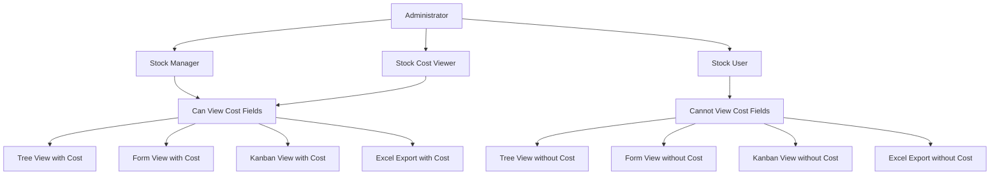
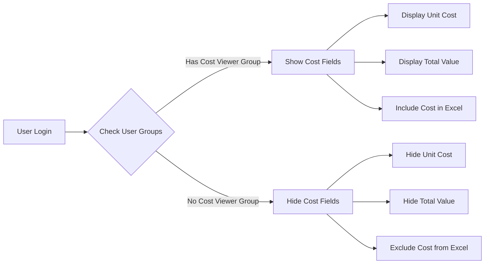

# Security Architecture Diagram

## User Group Hierarchy



## Implementation Flow



## Field Visibility Matrix

| View/Component | Regular User | Cost Viewer | Stock Manager |
|----------------|--------------|-------------|---------------|
| Tree View - Unit Cost | ❌ Hidden | ✅ Visible | ✅ Visible |
| Tree View - Total Value | ❌ Hidden | ✅ Visible | ✅ Visible |
| Form View - Unit Cost | ❌ Hidden | ✅ Visible | ✅ Visible |
| Form View - Total Value | ❌ Hidden | ✅ Visible | ✅ Visible |
| Kanban View - Unit Cost | ❌ Hidden | ✅ Visible | ✅ Visible |
| Kanban View - Total Value | ❌ Hidden | ✅ Visible | ✅ Visible |
| Excel Export - Cost Columns | ❌ Hidden | ✅ Visible | ✅ Visible |
| Search Filter - High Value | ❌ Hidden | ✅ Visible | ✅ Visible |

## Security Implementation Layers

```mermaid
graph TB
    A[Security Layer] --> B[Group-Based Access Control]
    A --> C[Field-Level Security]
    A --> D[View-Level Security]
    A --> E[Export-Level Security]
    
    B --> F[group_stock_cost_viewer]
    
    C --> G[unit_cost groups parameter]
    C --> H[total_value groups parameter]
    
    D --> I[Tree View groups attribute]
    D --> J[Form View groups attribute]
    D --> K[Kanban View groups attribute]
    
    E --> L[Excel Export Permission Check]
    E --> M[Wizard SQL Conditional Logic]