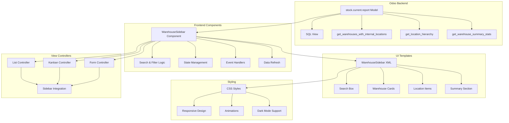
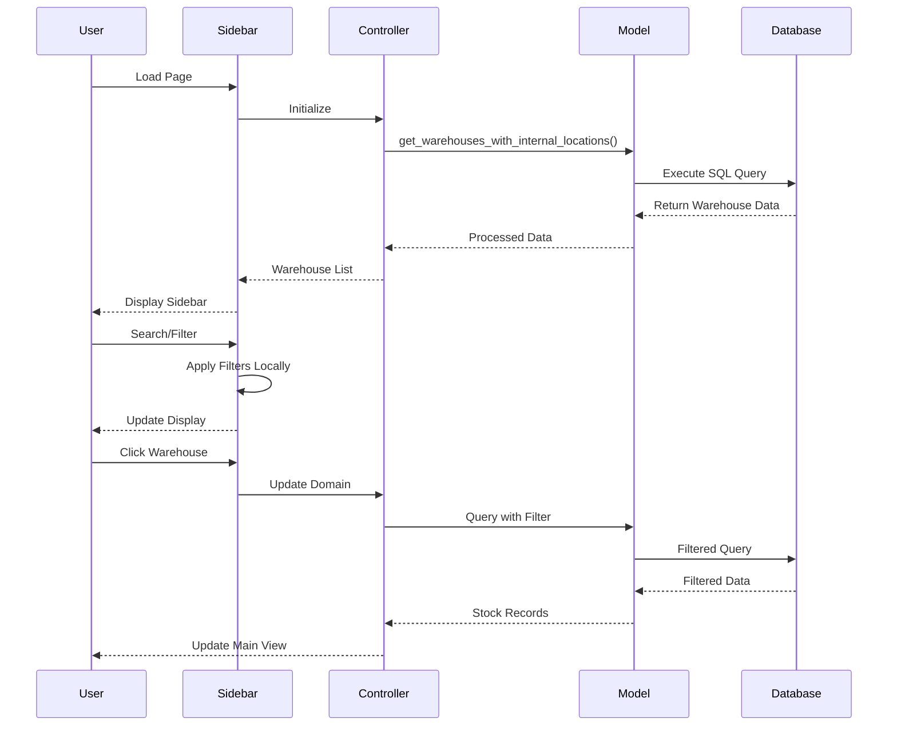
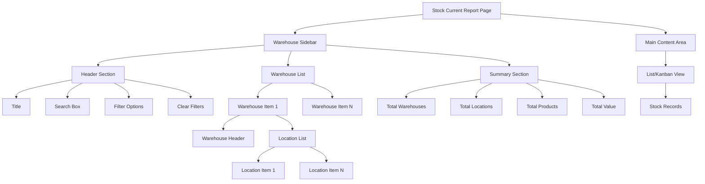
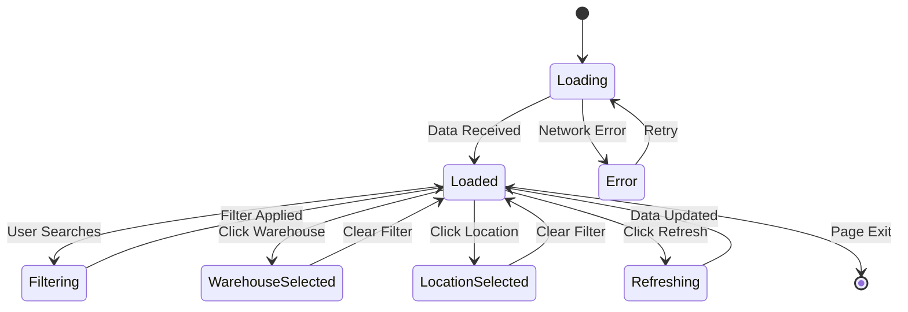
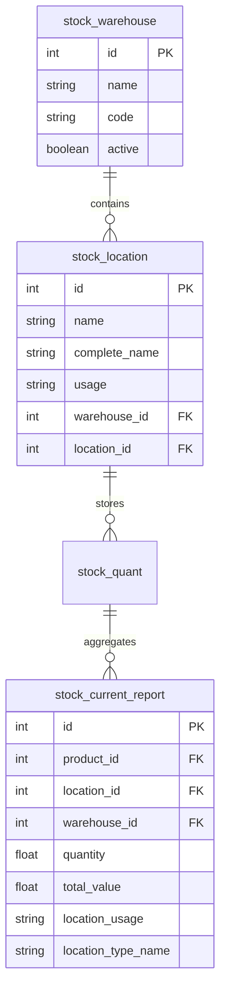
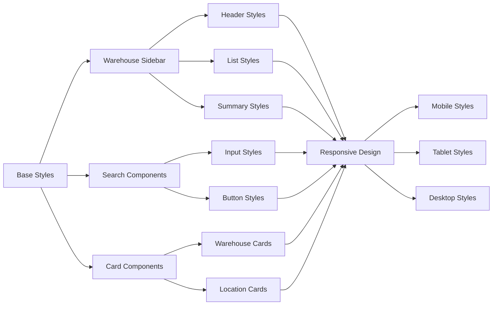
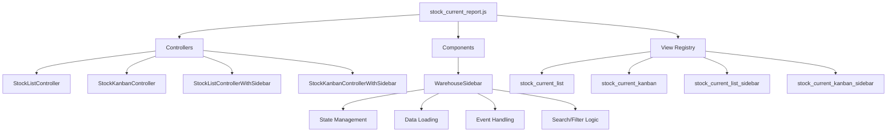

# Enhanced Sidebar Architecture

## System Architecture Overview

## Data Flow Diagram

## Component Hierarchy

## State Management Flow

## Database Schema Enhancement

## CSS Architecture

## JavaScript Module Structure

## Key Features Implementation

### 1. Search Functionality
- Real-time search across warehouse names, codes, and locations
- Debounced input to prevent excessive API calls
- Visual feedback for search state

### 2. Filter Options
- "Show only with stock" checkbox
- Warehouse type filters
- Location usage filters

### 3. Visual Enhancements
- Color-coded status indicators
- Icons for different location types
- Smooth animations for expand/collapse
- Hover effects and transitions

### 4. Performance Optimizations
- Efficient SQL queries with proper joins
- Client-side filtering for search
- Lazy loading for large datasets
- Caching of warehouse data

### 5. Responsive Design
- Adaptive layout for different screen sizes
- Touch-friendly interface for mobile
- Collapsible sidebar on small screens

This architecture provides a robust foundation for the enhanced sidebar functionality, ensuring good performance, maintainability, and user experience.