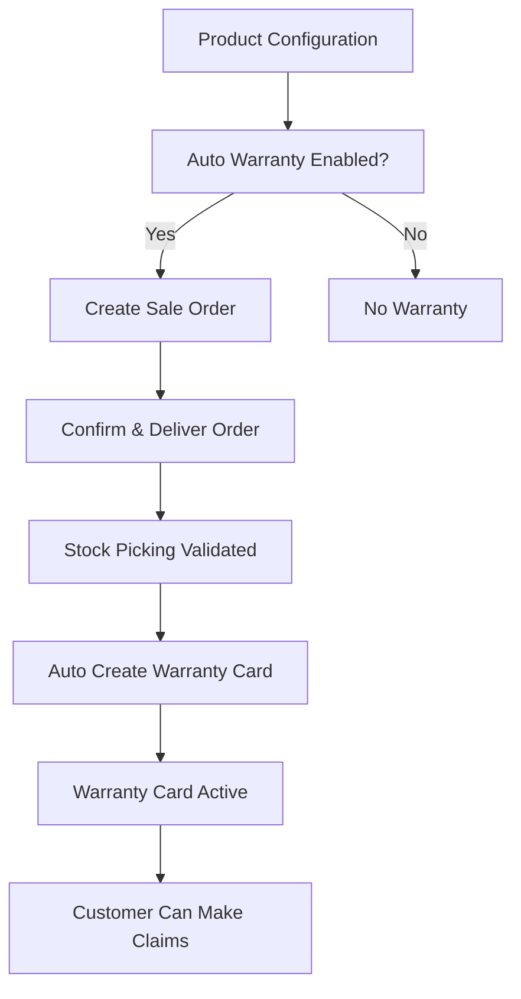
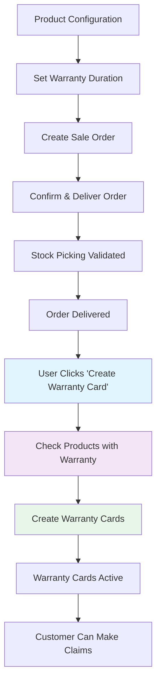

# Warranty Management Workflow Diagram

## Current Workflow (Automatic)


## New Workflow (Manual)


## Key Changes
1. **Removed**: Automatic warranty card creation on delivery
2. **Added**: Manual "Create Warranty Card" button on Sale Order
3. **Modified**: Product form to always show warranty duration (no auto checkbox)
4. **Preserved**: All warranty claim and RMA workflows

## Implementation Flow
```mermaid
sequenceDiagram
    participant User
    participant SO as Sale Order
    participant WC as Warranty Card
    participant SP as Stock Picking
    
    User->>SO: Create & Confirm Order
    SO->>SP: Create Delivery
    SP->>SP: Validate Delivery
    User->>SO: Click 'Create Warranty Card'
    SO->>SO: Check Delivered Products
    SO->>WC: Create Warranty Cards
    WC->>User: Show Created Cards