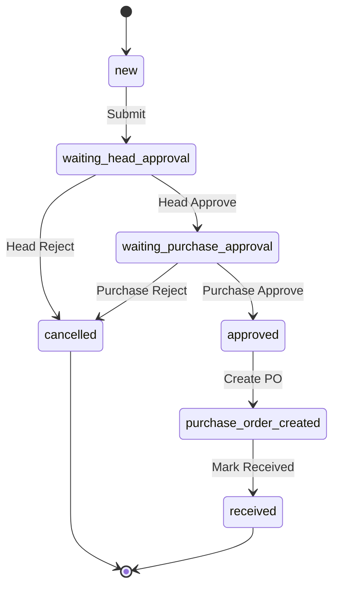
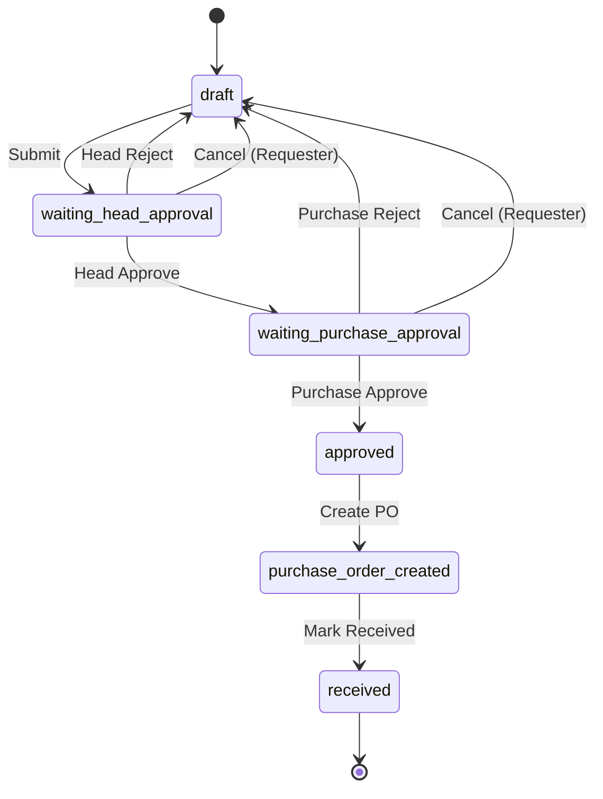

# Employee Purchase Requisition Workflow Diagram

## Current Workflow

## Proposed Workflow

## Key Changes

### State Changes
- **Removed**: `new` state
- **Added**: `draft` state (replaces `new`)
- **Modified**: Rejection paths now return to `draft` instead of `cancelled`

### New Functionality
1. **Edit Lock**: Documents only editable in `draft` state
2. **Cancel Button**: Available to original requester during approval waiting states
3. **Rejection Handling**: Rejected documents return to `draft` for re-editing

### Permission Matrix

| Action | Draft | Waiting Head Approval | Waiting Purchase Approval |
|--------|-------|----------------------|---------------------------|
| Edit Fields | ✅ Requester | ❌ Locked | ❌ Locked |
| Submit | ✅ Requester | ❌ N/A | ❌ N/A |
| Cancel | ❌ N/A | ✅ Requester | ✅ Requester |
| Head Approve | ❌ N/A | ✅ Head | ❌ N/A |
| Head Reject | ❌ N/A | ✅ Head | ❌ N/A |
| Purchase Approve | ❌ N/A | ❌ N/A | ✅ Purchase |
| Purchase Reject | ❌ N/A | ❌ N/A | ✅ Purchase |

### User Experience Flow

#### Requester Workflow
1. Create requisition in **draft** state
2. Edit all fields as needed
3. Submit for approval
4. If needed, cancel during approval to return to **draft**
5. If rejected, automatically returns to **draft** for editing
6. Resubmit after making changes

#### Approver Workflow
1. Receive requisition in waiting state
2. Cannot edit any fields (edit lock)
3. Can approve or reject
4. Rejection returns document to requester for editing

#### Benefits
- **Better Control**: Requesters can cancel documents before approval completion
- **Improved Workflow**: Rejected documents don't need to be recreated
- **Data Integrity**: Edit locks prevent unauthorized changes during approval
- **User Friendly**: Clear visual indicators and intuitive state transitions